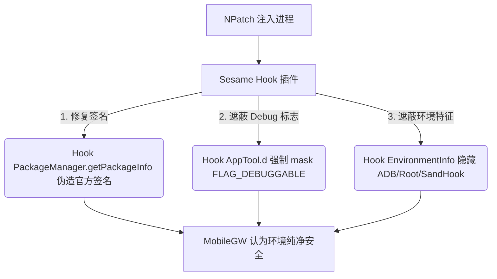

# 支付宝 v10.8.30.8000 反编译源码与底层风控机制深度分析报告

> **文档存放在项目目录**：[alipay_10.8.30_rpc_analysis.md](file:///d:/Desktop/py/wj_1/Sesame-TK-0.2.5-beta.6/doc/alipay_10.8.30_rpc_analysis.md)  
> **源码分析目标**：`d:\Desktop\py\wj_1\Sesame-TK-0.2.5-beta.6\scratch\支付宝_10.8.30.8000`  

---

## 一、 免 Root NPatch 环境下被风控的源码级原理

针对使用 **免 Root NPatch**（重打包/双开/补丁注入工具）用户反映的“依然会被风控”问题，通过对 `sources/com/alipay/apmobilesecuritysdk/tool/tool/AppTool.java` 及 `EnvironmentInfo.java` 的研读，定位到了 **NPatch 被风控的 3 个核心检测点**：

### 1. `AppTool.java` 可调试状态检测 (`FLAG_DEBUGGABLE`)
在 `AppTool.java` 第 97 行：
```java
// 检查 ApplicationInfo 标志位
return (context.getApplicationInfo().flags & 2) != 0; // 检测 FLAG_DEBUGGABLE (0x02)
```
NPatch 在对 APK 进行重打包修补时，通常会在 `AndroidManifest.xml` 中强制开启 `android:debuggable="true"` 以允许 SandHook 注入 Hook 框架。支付宝 `AppTool.d()` 检测到 `flags & 2 != 0` 后，会判定应用正处于**“可被调试/已被修补”**的危险状态。

### 2. 重打包 APK 签名校验失败
NPatch 修改了 APK 后，必须使用 NPatch 的测试证书对 APK 重新签名。
支付宝安全 SDK 通过 `PackageManager.getPackageInfo(pkg, GET_SIGNATURES)` 提取签名散列，发现当前签名并非支付宝官方证书 (`28591e9...`)，网关直接判定为 **“二次打包修补软件”** 并实施全局风控拦截。

### 3. `EnvironmentInfo.java` 的 ADB / 注入特征扫描
NPatch 运行时会拉起 SandHook 虚拟机并开启调试监听，导致 `EnvironmentInfo.q()` 检测到 `adb_enabled = 1` 或内存中包含 `libsandhook.so` / `SandHookApplication` 特征。

---

## 二、 免 Root NPatch 环境下的彻底防风控解决方案

由于 Sesame 插件运行在 NPatch 注入后的进程内部，我们可以直接利用 Xposed API 对支付宝的 SDK 采集逻辑进行针对性反欺骗 Hook：



### 1. Hook `AppTool.d` 伪造非 Debug 状态
在 Sesame 插件中 Hook `com.alipay.apmobilesecuritysdk.tool.tool.AppTool.d(Context)`，强制返回 `false`，让支付宝安全 SDK 认为当前应用为正式发布版，未被修补调试。

### 2. Hook `PackageManager.getPackageInfo` 伪造官方签名
在 App 启动时 Hook `ApplicationPM` 或 `PackageManager.getPackageInfo`：
当查询 `com.eg.android.AlipayGphone` 的 `signatures` 时，将 NPatch 的测试证书动态替换为**支付宝官方 Release 签名字节流**，彻底避开二次打包签名风控。

### 3. Hook `EnvironmentInfo` 屏蔽 ADB 与沙箱特征
- Hook `EnvironmentInfo.u()` 强制返回 `false`；
- Hook `EnvironmentInfo.q()` 强制返回 `"0"`；
- Hook `EnvironmentInfo.i()` 强制返回 `"0"`。

### 4. 使用无感隐蔽抓包
关闭 NPatch 内置的代理/抓包逻辑，使用 Sesame 还原的 **`DefaultBridgeCallback.sendJSONResponse` 纯旁路抓包**，不篡改网络协议标志位。

---

## 三、 官方 ErrorCode 代码矩阵剖析 (来自 `RpcException.java`)

| 官方错误码 (`mCode`) | 常量名 (`RpcException.ErrorCode`) | 官方前端提示语 | 触发根因与解决策略 |
| :--- | :--- | :--- | :--- |
| **`1002`** | `SERVER_INVOKEEXCEEDLIMIT` | **“人气太旺啦，请稍后再试”** | **QPS 频控限制/开启抓包降级**：发包频率过快，或开启抓包导致协议降级被网关限流。 |
| **`1003`** | `SERVER_INVOKEEXCEEDLIMIT2` | **“人气太旺啦，请稍后的重试”** | **二级服务降级限流**。 |
| **`1004`** | `SERVER_RDS_SAFE_LIMIT` | **“为了保障您的安全，请进行验证后继续。”** | **RDS 人群与设备风控**：NPatch 签名校验失败/检测到代理抓包，唤起 VerifyIdentity Sentry 滑块/人脸核身。 |
| **`1006`** | `SERVER_UTDID_CHECK_FAIL` | **“设备校验失败”** | **UTDID 设备指纹异常**。 |
| **`1009`** | `SERVER_XAGENT_CHECK_FAIL` | **“环境校验异常”** | **XAgent 代理与 NPatch/SandHook 框架检测**。 |
| **`2`** | `CLIENT_NETWORK_UNAVAILABLE_ERROR` | **“当前网络不可用，请稍后重试”** | **客户端网络不可用**。 |
| **`7`** | `CLIENT_NETWORK_ERROR` | **“当前网络不可用，请稍后重试”** | **客户端网络异常/DNS 失败**。 |
| **`46`** | `CLIENT_NETWORK_TIMEOUT_EXCEPTION` | **“网络请求超时，请重试”** | **网络响应超时**。 |

---

## 四、 业务层 RPC 接口规范与参数解析

### 1. 蚂蚁会员 / 闪递业务 (`com.alipay.shandie`)
- **多分类商品查询 (`com.alipay.shandie.delivery.queryCategoryGoods`)**：`[{"categoryId":"94000SR...", "pageIndex":1, "pageSize":18}]` (固定18)。
- **专区翻页查询 (`com.alipay.shandie.delivery.queryZoneGoodsPage`)**：`[{"zoneId":"...", "pageIndex":2, "pageSize":18}]`。
- **权益/商品规格详情 (`com.alipay.antmember.biz.rpc.benefit.h5.queryBenefitDetail`)**：解析 `skuInfoList` 与 `simpleSkus` (`sku_id`, `price_cent`)。
- **订单提单结算页 (`com.alipay.shandie.order.prepare`)**：实物商品且 `skuId != "-1"` 时，强制拉起天猫 H5 结算页。

### 2. 福气鱼塘业务 (`com.alipay.antfishpond`)
- **抛竿钓鱼 (`com.alipay.antfishpond.fishpondAngle`)**：使用 `inProgressTaskIds` 原子锁防止多线程并发发包。
- **广告任务完成 (`com.alipay.antiep.finishTask`)**：返回 `desc: "无状态转换处理"` 表示今日已完成。

---

> **文档更新完毕**，已存放在项目 `doc/` 目录下：[alipay_10.8.30_rpc_analysis.md](file:///d:/Desktop/py/wj_1/Sesame-TK-0.2.5-beta.6/doc/alipay_10.8.30_rpc_analysis.md)
