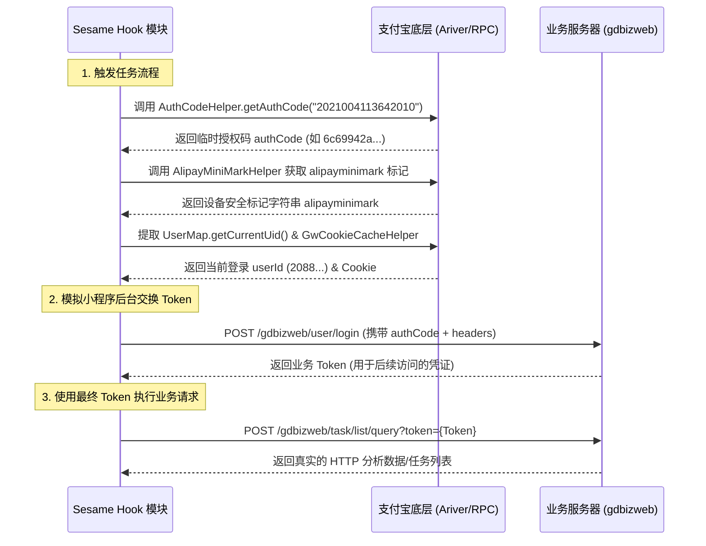

# 支付宝底层 HTTP/RPC 协议与抓包拦截深度分析报告

> **项目名称:** Sesame-TK  
> **面向对象:** 支付宝 App 内部网络传输层 Hook 及小程序自动化数据请求  
> **文档位置:** `doc/http_analysis.md` (已输出到项目文档目录)  

---

## 一、 支付宝网络抓包拦截深度分析与可行性解决方案

根据支付宝 10.8.30+ 的反编译源码以及 Sesame 项目的 Hook 源码，我们可以完整剖析为什么之前无法正常抓取到 HTTP 数据，并给出基于源码的修复方案。

### 1.1 支付宝底层网络架构梳理
支付宝的传输层主要由以下核心类构成：
1. **`HttpWorker`**: 底层网络请求的执行基类，封装了 Apache HttpClient 等底层连接，负责重试、代理分配和响应分发。
2. **`RpcHttpWorker`**: 继承自 `HttpWorker`，专门处理支付宝 RPC 网关服务（`mobilegw.alipay.com`）的加密请求。
3. **`H5HttpWorker`**: 继承自 `HttpWorker`，专门处理小程序的网页或部分传统 H5 请求。
4. **`TransportServiceImpl`** (NebulaX/ARiver 引擎): 小程序 `my.request` 等现代请求的最高级调度入口。

---

### 1.2 之前抓不到 HTTP/RPC 数据的根源分析

#### 1.2.1 根源一：MMTP/Bifrost 协议直连通道 Bypass（RPC 数据不完整）
在默认状态下，支付宝的 RPC 请求会优先启用 **MMTP（Mobile Multipart Transport Protocol）** 或 **Bifrost 通道**（基于原始 TCP Socket 的私有二进制协议）。
* **表现**: 该通道不通过 Java 层的 HTTP 协议栈，直接在 C++ 层和网关建立长连接。
* **后果**: 外部抓包工具（如 Charles、Fiddler、系统 WiFi 代理）完全无法捕获这一部分 RPC 流量。之前能抓到部分 RPC 是因为网络波动降级到了 HTTPS 握手。

#### 1.2.2 根源二：主动屏蔽系统 WiFi 代理（HTTP 抓不到）
即使部分请求走标准 HTTP 协议，支付宝也在底层重写了代理选择逻辑（`HttpWorker.determineProxyPlanner`）：
```java
public HttpProxyWrapper determineProxyPlanner(HttpParams httpParams) {
    ...
    if (getOriginRequest().isCapture() || MiscUtils.isDebugger(httpWorker.mContext)) {
        // 仅当开启捕获或调试模式时才使用系统代理
        httpParams2.setParameter("http.route.default-proxy", httpProxyWrapper.proxy);
        return httpProxyWrapper;
    }
    // 默认情况：将代理设为 ConnRouteParams.NO_HOST，强制无代理直连
    setNoProxyModel(httpParams2);
    httpProxyWrapper.proxy = null;
    return httpProxyWrapper;
}
```
* **后果**: 即使你的手机连着 Charles 代理，支付宝底层的 HttpClient 也会显式指定 `NO_HOST` 代理，完全无视系统的 WiFi 代理设置。

#### 1.2.3 根源三：Hook 拦截中的类名精确判断错误（H5 HTTP 无记录）
在 Sesame 项目的 `HttpCaptureHook.kt` 之前的实现中，通过 Hook `handleResponse` 抓取数据时，有如下一行代码：
```kotlin
val response = param.result ?: return
if (response.javaClass.name != CLASS_HTTP_URL_RESPONSE) return // CLASS_HTTP_URL_RESPONSE = "com.alipay.mobile.common.transport.http.HttpUrlResponse"
```
* **根源**: 小程序或 H5 请求（通过 `H5HttpWorker` 执行）在执行完毕后，其返回的响应对象实际为 **`com.alipay.mobile.common.transport.h5.H5HttpUrlResponse`**。
* **后果**: 虽然 `H5HttpUrlResponse` 继承自 `HttpUrlResponse`，但是其 `javaClass.name` 返回的是 `H5HttpUrlResponse` 的完整包名。上述精确等于判断导致所有 H5 请求在 `afterHookedMethod` 中被直接 `return` 丢弃，导致 HTTP 页面一直显示“无记录”。

#### 1.2.4 根源四：H5 响应内容采用 Stream 动态加载（点进去无响应数据）
普通的 `HttpUrlResponse` 在 `handleResponse` 时就会把所有的 Body 数据全部读入 `mResData` 字节数组中，可以直接通过 `getResData()` 获取。
但 `H5HttpUrlResponse` 是流式响应设计：
```java
public H5HttpUrlResponse(HttpUrlHeader httpUrlHeader, int i, String str, InputStream inputStream) {
    super(httpUrlHeader, i, str, null); // 最后一个参数 byte[] 传的是 null
    this.mInputStream = inputStream;
}
```
* **后果**: 它的 `mResData` 属性永远为 `null`！H5 容器会在后续使用中，通过 `getInputStream()` 动态读取。因此，直接在 `handleResponse` 刚结束时通过反射获取 `mResData` 只能得到 `null`。

---

### 1.3 完美的抓包 Hook 修复技术方案

结合支付宝源码逻辑，要想在项目里**彻底抓到**所有 HTTP 和 RPC 数据，必须通过以下 4 步 Hook 实现：

1. **禁用 TCP 直连（强制降级为标准 HTTP 流量）**
   Hook `HttpWorker`、`RpcHttpWorker`、`H5HttpWorker` 的 `isCanUseExtTransport(TransportContext)` 方法，使其始终返回 `false`。
   > **效果**: 屏蔽 MMTP/Bifrost 等 C++ 底层 TCP 直连协议，强制所有网络请求走 Java 标准的 HTTPS 链路。

2. **强制开启系统代理（绕过 NO_PROXY 屏蔽）**
   Hook `com.alipay.mobile.common.transport.http.HttpUrlRequest` 的 `isCapture()` 方法，使其始终返回 `true`。
   > **效果**: 让底层 HttpClient 的 `determineProxyPlanner` 路由能够顺利读取并启用系统 WiFi 代理（Charles/Fiddler 等）。

3. **放宽 `HttpCaptureHook` 的类名验证判断**
   将 `HttpCaptureHook.kt` 里的精确匹配改为继承关系匹配或支持两个类名：
   ```kotlin
   val responseClassName = response.javaClass.name
   if (responseClassName != "com.alipay.mobile.common.transport.http.HttpUrlResponse" && 
       responseClassName != "com.alipay.mobile.common.transport.h5.H5HttpUrlResponse") {
       return
   }
   ```

4. **流式数据截获（针对 H5 响应体）**
   对于 H5 请求，Hook `H5HttpUrlResponse` 的 `getInputStream()`。在其被调用时，返回一个代理包装类 `CaptureInputStream`。当系统或 H5 容器把数据流读完后，在 `close` 时回调将拦截的数据缓存并输出到详情中。

---
---

## 二、 Mini-Program 自动化 Token 获取与 OkHttp 自动化请求

在获取小程序外部请求（例如 `https://gdbizweb.alipay-eco.com` 接口）时，核心在于提取和拼装其敏感的加密 Header 和查询参数。

### 2.1 核心 Header 与 Token 的获取路径

#### 2.1.1 `alipayminimark` 的获取（小程序安全设备标记）
`alipayminimark` 是支付宝 Nebula 容器为小程序请求自动加签生成的设备/身份安全标记。可以通过反射调用支付宝工具类 `H5HttpUtils` 动态计算：
```kotlin
val h5HttpUtilsClass = XposedHelpers.findClass("com.alipay.mobile.nebula.util.H5HttpUtils", classLoader)
val alipayMiniMark = XposedHelpers.callStaticMethod(h5HttpUtilsClass, "getAlipayMiniMark", appId, version) as? String ?: ""
```
> **对应项目实现**: `fansirsqi.xposed.sesame.hook.internal.AlipayMiniMarkHelper.getAlipayMiniMark(appId, version)`

#### 2.1.2 临时授权码 `authCode` 的获取（OAuth2 免登入口）
要向第三方业务后台获取 `token`，首先需要从小程序前端向支付宝底层 RPC 请求 `authCode`。在 Sesame 项目中，可以通过反射 `Oauth2AuthCodeServiceImpl` 完成后台无感获取：
```kotlin
val oauth2AuthCodeServiceImplClass = XposedHelpers.findClass("com.alibaba.ariver.rpc.biz.proxy.Oauth2AuthCodeServiceImpl", classLoader)
val oauth2AuthCodeServiceImpl = XposedHelpers.newInstance(oauth2AuthCodeServiceImplClass)
// 构造 AuthSkipRequestModel 并传入对应 AppID，通过 getAuthSkipResult 获得 authCode
```
> **对应项目实现**: `fansirsqi.xposed.sesame.hook.internal.AuthCodeHelper.getAuthCode(appId)`

#### 2.1.3 `userid` 的获取
当前登录用户的 UID (`2088...`) 在支付宝进程中是全局共享的，可以通过 Sesame 项目的 `UserMap` 类直接提取：
```kotlin
val userId = fansirsqi.xposed.sesame.util.maps.UserMap.getCurrentUid()
```

#### 2.1.4 `Cookie` 的获取
部分小程序需要携带基础的 Gateway 状态 Cookie，可从底层的 `GwCookieCacheHelper` 获取：
```kotlin
val gwCookieCacheHelper = XposedHelpers.findClass("com.alipay.mobile.common.transport.http.GwCookieCacheHelper", classLoader)
val cookie = XposedHelpers.callStaticMethod(gwCookieCacheHelper, "getCookie", "alipay.com") as? String ?: ""
```

---

### 2.2 自动登录与 Token 换取逻辑流程

以目标小程序 `2021004113642010` 访问 `gdbizweb.alipay-eco.com` 接口为例，自动请求完整闭环流程如下：



---

### 2.3 完整的自动化请求 Kotlin 代码实现

以下是根据你提供的 OkHttp 代码模板整理出的、可在项目中直接执行的自动化网络请求助手类：

```kotlin
package fansirsqi.xposed.sesame.task.gdbiz

import android.os.Handler
import android.os.Looper
import fansirsqi.xposed.sesame.hook.ApplicationHook
import fansirsqi.xposed.sesame.hook.internal.AlipayMiniMarkHelper
import fansirsqi.xposed.sesame.hook.internal.AuthCodeHelper
import fansirsqi.xposed.sesame.util.Log
import fansirsqi.xposed.sesame.util.maps.UserMap
import okhttp3.MediaType.Companion.toMediaType
import okhttp3.OkHttpClient
import okhttp3.Request
import okhttp3.RequestBody.Companion.toRequestBody
import org.json.JSONObject
import java.io.IOException
import java.util.concurrent.TimeUnit

object GdbizWebClient {
    private const val TAG = "GdbizWebClient"
    private const val APP_ID = "2021004113642010"
    private const val APP_VERSION = "0.2.2605151701.50"

    private val client = OkHttpClient.Builder()
        .connectTimeout(15, TimeUnit.SECONDS)
        .readTimeout(15, TimeUnit.SECONDS)
        .build()

    /**
     * 1. 自动登录以换取目标业务 Token
     */
    private fun fetchBusinessToken(authCode: String, miniMark: String, userId: String, cookie: String): String? {
        try {
            val mediaType = "application/json".toMediaType()
            val loginJson = JSONObject().apply {
                put("authCode", authCode)
                put("userId", userId)
                put("source", "self")
            }
            val body = loginJson.toString().toRequestBody(mediaType)

            // 注意：这里假设登录接口为 /gdbizweb/user/login，请根据抓包真实登录路径修改
            val request = Request.Builder()
                .url("https://gdbizweb.alipay-eco.com/gdbizweb/user/login")
                .post(body)
                .addHeader("User-Agent", getUA())
                .addHeader("Content-Type", "application/json")
                .addHeader("alipayminimark", miniMark)
                .addHeader("userid", userId)
                .addHeader("Cookie", cookie)
                .build()

            client.newCall(request).execute().use { response ->
                if (!response.isSuccessful) return null
                val responseBody = response.body?.string() ?: ""
                val json = JSONObject(responseBody)
                // 假设返回格式为 {"code": 200, "data": {"token": "xxxx"}}
                if (json.optInt("code") == 200 || json.optString("status") == "success") {
                    return json.optJSONObject("data")?.optString("token")
                }
            }
        } catch (e: Exception) {
            Log.error(TAG, "登录换取 Token 失败: ${e.message}")
        }
        return null
    }

    /**
     * 2. 执行自动化业务请求
     */
    fun queryTaskList() {
        Thread {
            try {
                val classLoader = ApplicationHook.getClassLoader()
                
                // A. 动态获取设备安全标记
                val miniMark = AlipayMiniMarkHelper.getAlipayMiniMark(APP_ID, APP_VERSION)
                
                // B. 动态获取免登 authCode
                val authCode = AuthCodeHelper.getAuthCode(APP_ID)
                if (authCode.isNullOrEmpty()) {
                    Log.error(TAG, "获取 authCode 失败，中止请求。")
                    return@Thread
                }

                // C. 动态获取当前登录 UserID
                val userId = UserMap.getCurrentUid() ?: ""
                
                // D. 获取支付宝网关 Cookie
                val gwCookieCacheHelper = classLoader.loadClass("com.alipay.mobile.common.transport.http.GwCookieCacheHelper")
                val alipayCookie = de.robv.android.xposed.XposedHelpers.callStaticMethod(
                    gwCookieCacheHelper, "getCookie", "alipay.com"
                ) as? String ?: ""

                // E. 登录业务后台，换取真正的 Token
                val token = fetchBusinessToken(authCode, miniMark, userId, alipayCookie)
                if (token.isNullOrEmpty()) {
                    Log.error(TAG, "获取业务 Token 失败，中止请求。")
                    return@Thread
                }

                Log.record(TAG, "成功获取业务 Token: $token")

                // F. 构造你要实现的目标请求
                val mediaType = "application/json".toMediaType()
                val body = "{}".toRequestBody(mediaType)
                
                val request = Request.Builder()
                    .url("https://gdbizweb.alipay-eco.com/gdbizweb/task/list/query?channelSource=self&token=$token&version=3")
                    .post(body)
                    .addHeader("User-Agent", getUA())
                    .addHeader("Accept-Encoding", "gzip")
                    .addHeader("Content-Type", "application/json")
                    .addHeader("accept-charset", "UTF-8")
                    .addHeader("referer", "https://$APP_ID.hybrid.alipay-eco.com/$APP_ID/$APP_VERSION/index.html#pages/index/index")
                    .addHeader("x-release-type", "ONLINE")
                    .addHeader("userid", userId)
                    .addHeader("alipayminimark", miniMark)
                    .addHeader("x-allow-afts-limit", "true")
                    .addHeader("Cookie", alipayCookie)
                    .build()

                client.newCall(request).execute().use { response ->
                    val code = response.code
                    val responseData = response.body?.string() ?: ""
                    Log.record(TAG, "请求返回代码: $code, 数据长度: ${responseData.length}")
                    Log.record(TAG, "返回数据明文: $responseData")
                }
            } catch (e: Exception) {
                Log.printStackTrace(TAG, "自动化请求执行抛出异常", e)
            }
        }.start()
    }

    private fun getUA(): String {
        val systemUa = System.getProperty("http.agent") ?: "Mozilla/5.0 (Linux; Android 15)"
        val alipayVer = ApplicationHook.getAlipayVersion() ?: "10.8.50"
        return "$systemUa Version/4.0 Chrome/126.0.6478.122 MYWeb/1.3.126.260313173624 UWS/3.22.2.9999 UCBS/3.22.2.9999_220000000000 Mobile Safari/537.36 NebulaSDK/1.8.100112 Nebula AlipayDefined(nt:WIFI,ws:407|0|3.0) AliApp(AP/$alipayVer) AlipayClient/$alipayVer Language/zh-Hans isConcaveScreen/true Region/CNAriver/$alipayVer ChannelId(4) DTN/2.0"
    }
}
```

---
**提示与参考值**: 
1. **`alipayminimark`** 和 **`authCode`** 具有较短的时效性，在做任何周期性后台请求时，必须通过该对象封装的逻辑进行**即时获取**，不能做本地长期缓存。
2. 将此对象集成到 Sesame-TK 模块的初始化或某个自动任务（Task）执行序列中，可以实现完全免介入、全自动化的 HTTP 业务抓取。
