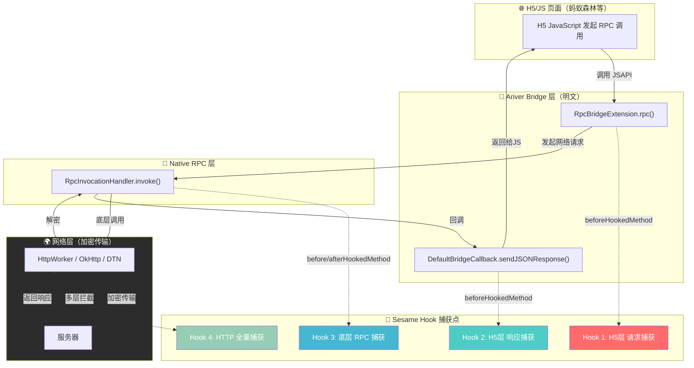
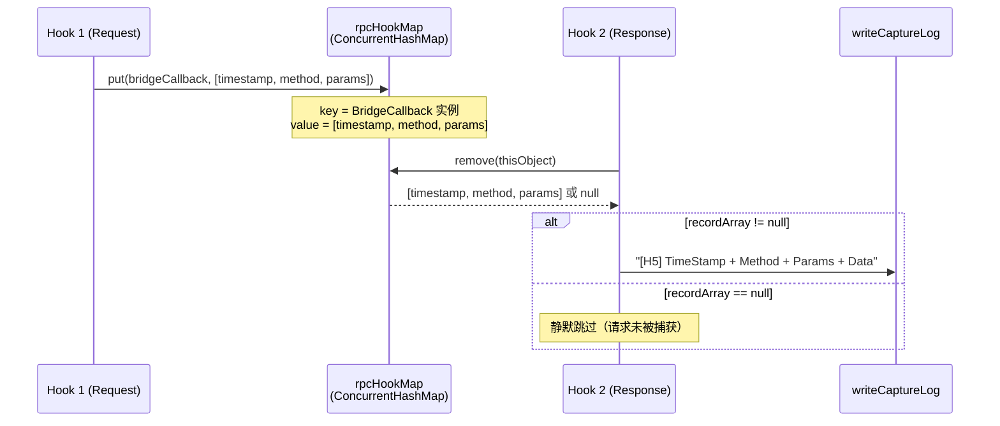
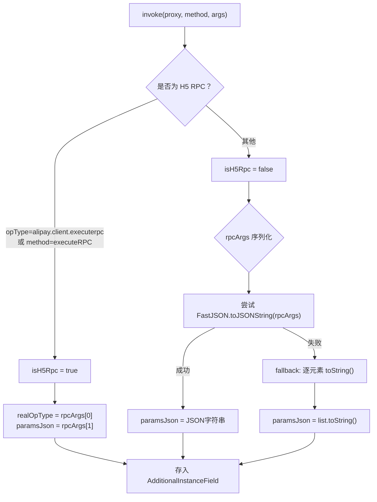
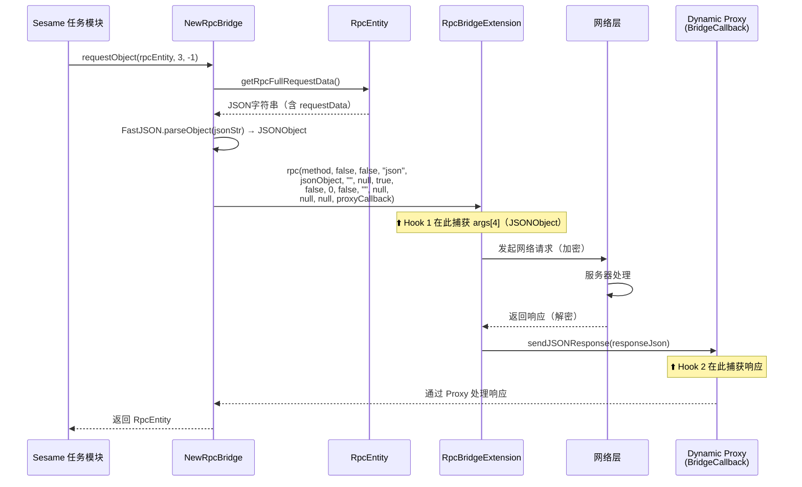
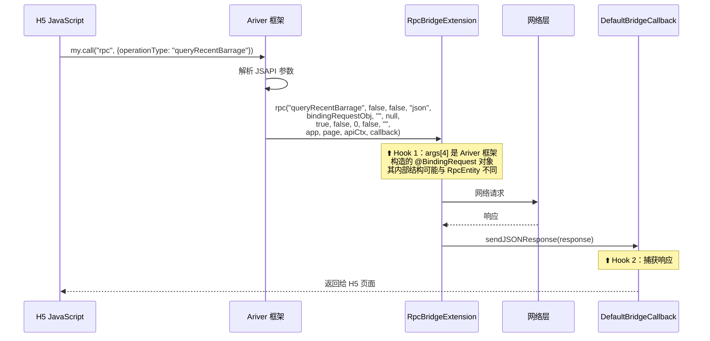
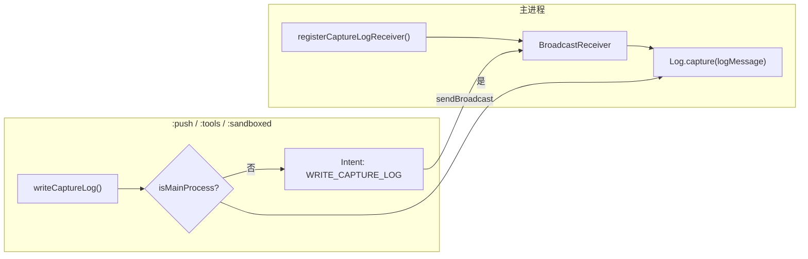

# Sesame-TK RPC 抓包调试系统 完整分析报告

> **项目版本**: Sesame-TK 0.2.5-beta.6  
> **目标应用**: 支付宝 v10.8.30.8000  
> **分析日期**: 2026-08-10  
> **触发问题**: 抓包调试模式下 `queryRecentBarrage` 等接口返回空参数 `Params: []`

---

## 一、系统架构总览

### 1.1 整体数据流



### 1.2 关键结论

> [!IMPORTANT]
> **所有 Hook 点均位于加密层之上**，捕获到的请求参数和响应数据均为**明文**，不存在加密问题。

---

## 二、Hook 层详细分析

### 2.1 Hook 1：H5 层请求捕获

**源文件**: [LifecycleManager.java#L536-L581](file:///d:/Desktop/py/wj_1/Sesame-TK-0.2.5-beta.6/app/src/main/java/fansirsqi/xposed/sesame/hook/lifecycle/LifecycleManager.java#L536-L581)

**Hook 目标**: `com.alibaba.ariver.commonability.network.rpc.RpcBridgeExtension#rpc`

#### 目标方法签名（来自支付宝反编译源码）

**源文件**: [RpcBridgeExtension.java#L165](file:///d:/Desktop/py/wj_1/Sesame-TK-0.2.5-beta.6/scratch/支付宝_10.8.30.8000/sources/com/alibaba/ariver/commonability/network/rpc/RpcBridgeExtension.java#L165)

| 参数索引 | 类型 | 注解 | 含义 |
|---------|------|------|------|
| `args[0]` | `String` | `@BindingParam("operationType")` | RPC 方法名，如 `alipay.antmember.forest.h5.queryRecentBarrage` |
| `args[1]` | `boolean` | `@BindingParam("openRpc")` | 是否开放 RPC |
| `args[2]` | `boolean` | `@BindingParam("httpGet")` | 是否使用 HTTP GET |
| `args[3]` | `String` | `@BindingParam("type")` | 请求类型，默认 `"json"` |
| `args[4]` | `JSONObject` | **`@BindingRequest`** | **⚠️ 完整请求体 JSON，不是业务参数本身** |
| `args[5]` | `String` | `@BindingParam("gateway")` | 网关地址 |
| `args[6]` | `JSONObject` | `@BindingParam("headers")` | 自定义请求头 |
| `args[7]` | `boolean` | `@BindingParam("compress")` | 是否压缩，默认 `true` |
| `args[8]` | `boolean` | `@BindingParam("retryable")` | 是否可重试 |
| `args[9]` | `int` | `@BindingParam("timeout")` | 超时时间（毫秒） |
| `args[10]` | `boolean` | `@BindingParam("getResponse")` | 是否获取完整响应 |
| `args[11]` | `String` | `@BindingParam("region")` | 区域 |
| `args[12]` | `App` | `@BindingNode(App.class)` | 小程序 App 实例 |
| `args[13]` | `Page` | `@BindingNode(Page.class)` | 当前页面实例 |
| `args[14]` | `ApiContext` | `@BindingApiContext` | API 上下文 |
| `args[15]` | `BridgeCallback` | `@BindingCallback` | 回调对象（用作 rpcHookMap 的 key） |

#### `@BindingRequest` JSONObject（args[4]）内部结构

当 Sesame 自身通过 [NewRpcBridge.java#L136](file:///d:/Desktop/py/wj_1/Sesame-TK-0.2.5-beta.6/app/src/main/java/fansirsqi/xposed/sesame/hook/rpc/bridge/NewRpcBridge.java#L136) 发起调用时，`args[4]` 由 [RpcEntity.kt#L49-L86](file:///d:/Desktop/py/wj_1/Sesame-TK-0.2.5-beta.6/app/src/main/java/fansirsqi/xposed/sesame/entity/RpcEntity.kt#L49-L86) 的 `getRpcFullRequestData()` 构造：

```json
{
  "__apiCallStartTime": 1786365513000,
  "apiCallLink": "XRiverNotFound",
  "appName": null,
  "execEngine": "XRiver",
  "facadeName": null,
  "methodName": "taskFeedback",
  "operationType": "alipay.antmember.forest.h5.queryHomePage",
  "requestData": { "version": "6" },
  "relationLocal": null
}
```

> [!WARNING]
> **`args[4]` 不是业务参数！** 它是 `@BindingRequest` 标注的**完整请求体**。真正的业务参数在其内部的 `requestData` 字段中。对于支付宝 H5 自身发起的请求，这个结构可能完全不同，甚至 `requestData` 可能不存在。

#### 15参数重载方法

支付宝源码中还存在一个 **15参数** 的重载版本（不含 `ApiContext`）：

```java
// RpcBridgeExtension.java#L189
public void rpc(String str, boolean z, boolean z2, String str2, 
    JSONObject jSONObject, String str3, JSONObject jSONObject2, 
    boolean z3, boolean z4, int i, boolean z5, String str4, 
    App app, Page page, BridgeCallback bridgeCallback) throws Throwable {
    // 内部调用16参数版本，ApiContext 传 null
    this.rpc(str, z, z2, str2, jSONObject, str3, jSONObject2, 
             z3, z4, i, z5, str4, app, page, null, bridgeCallback);
}
```

> [!NOTE]
> 当前 Hook 匹配的是 **16参数版本**，因此无论外部调用15参数还是16参数版本，最终都会被 Hook 到。

---

### 2.2 Hook 2：H5 层响应捕获

**源文件**: [LifecycleManager.java#L587-L619](file:///d:/Desktop/py/wj_1/Sesame-TK-0.2.5-beta.6/app/src/main/java/fansirsqi/xposed/sesame/hook/lifecycle/LifecycleManager.java#L587-L619)

**Hook 目标**: `com.alibaba.ariver.engine.common.bridge.internal.DefaultBridgeCallback#sendJSONResponse`

#### 工作原理



#### 关联机制

- 请求时以 `args[15]`（`BridgeCallback` 实例）作为 key 存入 `rpcHookMap`
- 响应时以 `param.thisObject`（即同一个 `DefaultBridgeCallback` 实例）作为 key 取出
- 由于支付宝内部 `BridgeCallback → DefaultBridgeCallback` 的对应关系，请求和响应能正确配对

> [!CAUTION]
> 如果 `RpcBridgeExtension.rpc()` 内部的回调对象与 `DefaultBridgeCallback.sendJSONResponse()` 的 `thisObject` 不是同一个对象（例如经过了包装代理），则关联会失败，导致 `recordArray` 为 `null`，该条抓包记录**会丢失**。

---

### 2.3 Hook 3：底层 RPC 捕获

**源文件**: [LifecycleManager.java#L626-L744](file:///d:/Desktop/py/wj_1/Sesame-TK-0.2.5-beta.6/app/src/main/java/fansirsqi/xposed/sesame/hook/lifecycle/LifecycleManager.java#L626-L744)

**Hook 目标**: `com.alipay.mobile.common.rpc.RpcInvocationHandler#invoke`

#### 参数捕获策略



#### 响应捕获

在 `afterHookedMethod` 中：
- 通过 `param.getResult()` 获取返回值
- 使用 `FastJSON.toJSONString(result)` 序列化为 JSON 字符串
- 异常时记录 `"Error: " + throwable.toString()` 或 `"Error serializing: " + t.toString()`

#### 输出格式

```
[BOTTOM] ========================>
TimeStamp: 1786365513476
Method: alipay.antmember.forest.h5.queryHomePage
Params: {"version":"6"}
Data: {"resultCode":"SUCCESS",...}
<========================
```

---

### 2.4 Hook 4：HTTP 全量捕获（HttpCaptureHook）

**源文件**: [HttpCaptureHook.kt](file:///d:/Desktop/py/wj_1/Sesame-TK-0.2.5-beta.6/app/src/main/java/fansirsqi/xposed/sesame/hook/network/HttpCaptureHook.kt)

> [!NOTE]
> 此模块由 `BaseModel.enableHttpCapture` 单独控制，与 `debugMode`（RPC 抓包）相互独立。

#### 覆盖的网络层

| 层级 | Hook 目标 | 捕获内容 |
|------|-----------|----------|
| **支付宝传输层** | `HttpWorker.call()` / `H5HttpWorker.handleResponse()` | 使用 `CaptureInputStream` 包装流 |
| **H5 插件层** | `H5HttpPlugin.httpRequest()` | H5 Web 请求参数 |
| **标准 HTTP** | `URL.openConnection()` / `HttpURLConnectionImpl` | `getOutputStream` / `getInputStream` / `getResponseCode` |
| **OkHttp** | `okhttp3.RealCall.execute()` / `enqueue()` | 同步+异步请求，动态代理 `Callback.onResponse` |
| **Ariver 传输层** | `TransportServiceImpl.httpRequest()` | `RVHttpRequest` 请求对象 |
| **DTN 网络** | `DtnHttpClient.executeHttpRequest()` | DTN 专有协议 |

#### 数据处理能力

- **自动解压**: GZIP / Deflate 编码自动检测解压
- **编码识别**: 文本可打印比率评估，UTF-8 URL 解码或 Base64 编码
- **流量分类**: `CaptureClassifier` 自动分类

---

## 三、空参数问题根因分析

### 3.1 问题现象

```
TimeStamp: 1786365513476
Method: alipay.antmember.forest.h5.queryRecentBarrage
Params: []
Data: "{"barrages":[],"resultCode":"SUCCESS","resultDesc":"成功","retriable":false,"success":true}"
```

### 3.2 根因分析

#### 原因 1：参数提取方式不当（代码缺陷，已修复）

**修复前代码**:
```java
// LifecycleManager.java 原始代码
recordArray[2] = args[4];  // 直接存储 JSONObject 引用
```

**问题**: `args[4]` 是 `@BindingRequest` 标注的**完整请求体 JSONObject**，对其直接调用 `String.valueOf()` 的行为取决于该 JSONObject 的内部实现。在某些场景下：

1. 当 JSONObject 内部数据为空时，`toString()` 可能返回 `{}`、`[]` 或空字符串
2. 由于是对象引用而非快照，在 `beforeHookedMethod` 保存引用后，JSONObject 可能在 `rpc()` 方法执行过程中被修改
3. 对于支付宝 H5 自身发起的请求（非 Sesame 发起），JSONObject 结构可能与 `RpcEntity` 构造的不同

**修复后代码**:
```java
// 修复后：提取 requestData 字段
String paramsStr = "";
try {
    Object requestJson = args[4];
    if (requestJson != null) {
        Object requestData = XposedHelpers.callMethod(requestJson, "get", "requestData");
        if (requestData != null) {
            paramsStr = String.valueOf(requestData);
        } else {
            paramsStr = String.valueOf(XposedHelpers.callMethod(requestJson, "toJSONString"));
        }
    }
} catch (Throwable t) {
    paramsStr = args[4] != null ? args[4].toString() : "null";
}
```

#### 原因 2：接口本身无参数（正常现象）

`alipay.antmember.forest.h5.queryRecentBarrage`（查询最近弹幕）是一个**无参数查询接口**，类似于 HTTP `GET` 请求不需要 request body。即使修复了参数提取逻辑，该接口的 `requestData` 也可能为 `null` 或 `{}`。

这可以从响应数据验证：

```json
{
  "barrages": [],       // 弹幕列表（当前为空）
  "resultCode": "SUCCESS",
  "resultDesc": "成功",
  "retriable": false,
  "success": true
}
```

服务端正常返回了 `SUCCESS`，说明请求本身是正确的，接口设计上不需要额外参数。

### 3.3 各种接口的参数情况对照

| 接口方法名 | 预期参数 | 说明 |
|-----------|---------|------|
| `queryRecentBarrage` | `null` / `{}` | ✅ 无参数查询接口 |
| `queryHomePage` | `{"version":"6"}` | 需要版本号参数 |
| `collectEnergy` | `{"bubbleId":"xxx","userId":"xxx"}` | 需要气泡和用户 ID |
| `queryFriendHomePage` | `{"userId":"xxx"}` | 需要目标用户 ID |
| `queryEnergyRainHome` | `{}` | 无参数 |

---

## 四、RPC 调用链路对比

### 4.1 Sesame 自身发起的 RPC（通过 NewRpcBridge）



### 4.2 支付宝 H5 自身发起的 RPC



> [!IMPORTANT]
> **关键差异**: Sesame 发起的调用中 `args[4]` 来自 `RpcEntity.getRpcFullRequestData()`，结构是已知的。而支付宝 H5 自身发起的调用中 `args[4]` 由 Ariver 框架通过 `@BindingRequest` 注解自动绑定，其内部结构取决于 H5 页面传入的原始 JSON 对象。

---

## 五、关键组件详解

### 5.1 RpcEntity 请求数据构造

**源文件**: [RpcEntity.kt#L49-L86](file:///d:/Desktop/py/wj_1/Sesame-TK-0.2.5-beta.6/app/src/main/java/fansirsqi/xposed/sesame/entity/RpcEntity.kt#L49-L86)

```kotlin
val rpcFullRequestData: String
    get() {
        val jo = JSONObject()
        jo.put("__apiCallStartTime", System.currentTimeMillis())
        jo.put("apiCallLink", "XRiverNotFound")
        jo.put("appName", this.appName)
        jo.put("execEngine", "XRiver")
        jo.put("facadeName", this.facadeName)
        jo.put("methodName", this.methodName)
        jo.put("operationType", this.requestMethod)
        // requestData 是业务参数
        if (this.requestData != null) {
            val trimmed = this.requestData.trim()
            val repaired = repairJson(trimmed)
            // 解析为 JSONArray 或 JSONObject
            jo.put("requestData", ...)
        }
        jo.put("relationLocal", this.requestRelation)
        return jo.toString()
    }
```

### 5.2 RPC 过滤器

**源文件**: [LifecycleManager.java#L756-L789](file:///d:/Desktop/py/wj_1/Sesame-TK-0.2.5-beta.6/app/src/main/java/fansirsqi/xposed/sesame/hook/lifecycle/LifecycleManager.java#L756-L789)

#### 动态配置过滤器（`httpCaptureFilter`）

通过 `DataStore` 读取用户自定义过滤关键词，默认值：
```
log.alipay.com, mdap.alipay.com, diagnose.alipay.com,
alipay.client.executerpc, alipay.client.interfere.config.get,
alipay.client.getDynamicBundle, alipay.client.getUnionResource
```

#### 硬编码过滤关键词

| 关键词 | 过滤原因 |
|--------|---------|
| `wireless.audit` | 无线审计日志 |
| `locate.service` | 定位服务 |
| `uploadlog` / `log.upload` | 日志上传 |
| `behavior.logs` / `behaviorlog` | 行为日志 |
| `diagnose` | 诊断信息 |
| `reportactive` | 活跃上报 |
| `monitor` | 监控数据 |
| `alipay.client` | 客户端内部调用 |
| `telemetry` | 遥测数据 |

### 5.3 跨进程日志写入

**源文件**: [LifecycleManager.java#L444-L494](file:///d:/Desktop/py/wj_1/Sesame-TK-0.2.5-beta.6/app/src/main/java/fansirsqi/xposed/sesame/hook/lifecycle/LifecycleManager.java#L444-L494)



### 5.4 响应数据自动处理

**源文件**: [RpcResponseHandler.java](file:///d:/Desktop/py/wj_1/Sesame-TK-0.2.5-beta.6/app/src/main/java/fansirsqi/xposed/sesame/hook/RpcResponseHandler.java)

当 `BaseModel.getAutoTokenEnabled()` 开启时，自动从响应中提取关键数据：

| RPC 方法 | 提取内容 | 存储位置 |
|---------|---------|---------|
| `com.alipay.antfishpond.fishpondAngle` | `riskToken` 字段 | `OtherTask.fishpondToken` |

提取方式采用**字符串直接搜索**（非 JSON 解析），性能更优：
```java
final String targetKey = "\"riskToken\":\"";
int tokenPos = rawJson.indexOf(targetKey);
```

---

## 六、两套 RPC Bridge 实现对比

| 特性 | NewRpcBridge | OldRpcBridge |
|------|-------------|-------------|
| **源文件** | [NewRpcBridge.java](file:///d:/Desktop/py/wj_1/Sesame-TK-0.2.5-beta.6/app/src/main/java/fansirsqi/xposed/sesame/hook/rpc/bridge/NewRpcBridge.java) | [OldRpcBridge.java](file:///d:/Desktop/py/wj_1/Sesame-TK-0.2.5-beta.6/app/src/main/java/fansirsqi/xposed/sesame/hook/rpc/bridge/OldRpcBridge.java) |
| **最低版本** | v10.3.96.8100+ | 更早版本 |
| **入口类** | `RpcBridgeExtension` (Ariver) | `H5RpcUtil.rpcCall` (Nebula) |
| **回调方式** | 动态代理 `BridgeCallback` | 同步返回 `H5Response` |
| **请求构造** | `RpcEntity.getRpcFullRequestData()` → FastJSON 解析 | 直接传 `requestData` 字符串 |
| **错误处理** | 1009 滑块验证 / 2000 登录超时 | 系统繁忙 / 登录超时 / 1004 能量异常 / MMTP |
| **当前使用** | ✅ 默认使用 | ❌ 备用 |

---

## 七、修复记录与建议

### 7.1 已实施的修复

**修复文件**: [LifecycleManager.java#L556-L579](file:///d:/Desktop/py/wj_1/Sesame-TK-0.2.5-beta.6/app/src/main/java/fansirsqi/xposed/sesame/hook/lifecycle/LifecycleManager.java#L556-L579)

```diff
- Object[] recordArray = new Object[4];
- recordArray[0] = System.currentTimeMillis();
- recordArray[1] = args[0];
- recordArray[2] = args[4];
- rpcHookMap.put(object, recordArray);
+ // args[4] 是 @BindingRequest JSONObject，包含完整请求体
+ // 需要从中提取 requestData 字段获取真正的业务参数
+ String paramsStr = "";
+ try {
+     Object requestJson = args[4];
+     if (requestJson != null) {
+         Object requestData = XposedHelpers.callMethod(requestJson, "get", "requestData");
+         if (requestData != null) {
+             paramsStr = String.valueOf(requestData);
+         } else {
+             paramsStr = String.valueOf(XposedHelpers.callMethod(requestJson, "toJSONString"));
+         }
+     }
+ } catch (Throwable t) {
+     paramsStr = args[4] != null ? args[4].toString() : "null";
+ }
+ Object[] recordArray = new Object[4];
+ recordArray[0] = System.currentTimeMillis();
+ recordArray[1] = args[0];
+ recordArray[2] = paramsStr;
+ rpcHookMap.put(object, recordArray);
```

### 7.2 潜在改进建议

> [!TIP]
> 以下为可选优化方向，不影响当前修复的正确性。

1. **快照而非引用**: 修复后已将 `args[4]` 的值提前序列化为字符串，避免了对象引用被后续修改的问题。

2. **`rpcHookMap` 内存泄漏风险**: 如果请求发出但回调从未被调用（例如超时、网络中断），`rpcHookMap` 中的条目永远不会被清除。建议增加定期清理机制或使用 `WeakHashMap`。

3. **Hook 关联失败检测**: 当 Hook 2 中 `rpcHookMap.remove(callback)` 返回 `null` 时，说明请求捕获与响应捕获未成功关联。可以增加日志记录这种情况，帮助排查遗漏的 RPC 调用。

4. **15参数重载方法覆盖**: 虽然15参数版本内部最终调用16参数版本，但如果支付宝未来版本修改了这个调用关系，建议同时 Hook 15参数版本作为保险。

---

## 八、附录

### 8.1 项目文件索引

| 文件 | 用途 |
|------|------|
| [LifecycleManager.java](file:///d:/Desktop/py/wj_1/Sesame-TK-0.2.5-beta.6/app/src/main/java/fansirsqi/xposed/sesame/hook/lifecycle/LifecycleManager.java) | 生命周期管理 + RPC 调试 Hook 主体 |
| [NewRpcBridge.java](file:///d:/Desktop/py/wj_1/Sesame-TK-0.2.5-beta.6/app/src/main/java/fansirsqi/xposed/sesame/hook/rpc/bridge/NewRpcBridge.java) | 新版 RPC 调用桥接 |
| [OldRpcBridge.java](file:///d:/Desktop/py/wj_1/Sesame-TK-0.2.5-beta.6/app/src/main/java/fansirsqi/xposed/sesame/hook/rpc/bridge/OldRpcBridge.java) | 旧版 RPC 调用桥接 |
| [RpcEntity.kt](file:///d:/Desktop/py/wj_1/Sesame-TK-0.2.5-beta.6/app/src/main/java/fansirsqi/xposed/sesame/entity/RpcEntity.kt) | RPC 请求/响应实体 |
| [RpcResponseHandler.java](file:///d:/Desktop/py/wj_1/Sesame-TK-0.2.5-beta.6/app/src/main/java/fansirsqi/xposed/sesame/hook/RpcResponseHandler.java) | RPC 响应自动处理 |
| [HookUtil.kt](file:///d:/Desktop/py/wj_1/Sesame-TK-0.2.5-beta.6/app/src/main/java/fansirsqi/xposed/sesame/hook/HookUtil.kt) | Hook 工具类（已废弃） |
| [HttpCaptureHook.kt](file:///d:/Desktop/py/wj_1/Sesame-TK-0.2.5-beta.6/app/src/main/java/fansirsqi/xposed/sesame/hook/network/HttpCaptureHook.kt) | HTTP 全量捕获 |
| [BaseModel.java](file:///d:/Desktop/py/wj_1/Sesame-TK-0.2.5-beta.6/app/src/main/java/fansirsqi/xposed/sesame/model/BaseModel.java) | 配置模型（debugMode 开关） |

### 8.2 支付宝反编译文件索引

| 文件 | 用途 |
|------|------|
| [RpcBridgeExtension.java](file:///d:/Desktop/py/wj_1/Sesame-TK-0.2.5-beta.6/scratch/支付宝_10.8.30.8000/sources/com/alibaba/ariver/commonability/network/rpc/RpcBridgeExtension.java) | H5 RPC 桥接扩展（Ariver 框架） |
| DefaultBridgeCallback.java | 默认桥接回调实现 |
| RpcInvocationHandler.java | 底层 RPC 动态代理处理器 |
